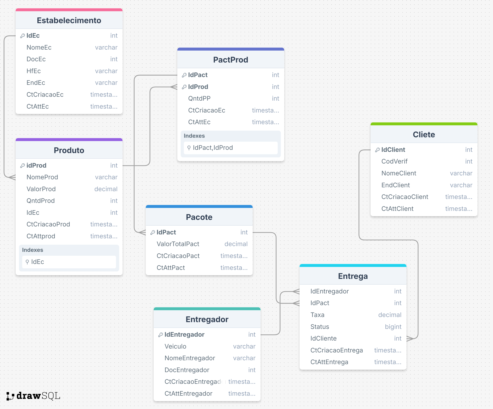

# Dylivery  
*Sistema acadêmico para controle e registro de entregas entre clientes, estabelecimentos e entregadores.*

---


---

## Sobre o projeto

O **Dylivery** é um sistema acadêmico desenvolvido como parte da disciplina de **Banco de Dados** da **PUC-GO**, sob orientação do professor **Isacio Rafael Pereira Galeano**.  
Seu objetivo é permitir o **registro e controle de entregas** realizadas entre **estabelecimentos, clientes e entregadores**, promovendo a integração e o gerenciamento eficiente do fluxo de pedidos.

O projeto foi desenvolvido com foco na implementação prática dos conceitos de **modelagem de dados**, **normalização** e **integridade referencial**, utilizando o **PostgreSQL** como sistema gerenciador de banco de dados.

---

## O que o projeto faz

- Cadastro de **clientes**, **estabelecimentos** e **entregadores**  
- Registro de **produtos** e **pedidos (pacotes)**  
- Associação entre **pedido e entregador**  
- Acompanhamento do **status das entregas** (pendente, em rota, entregue, cancelado, problema)  
- Geração de **relatórios** com quantidade e valores de pedidos entregues  

---

## Por que o projeto é útil

O **Dylivery** atende redes de estabelecimentos que realizam entregas próprias, preenchendo uma lacuna comum:  
> a falta de controle sobre o fluxo de pedidos e o histórico de entregas.

Com ele, é possível:
- Acompanhar o desempenho de entregadores  
- Manter um histórico de clientes e pedidos  
- Gerar relatórios financeiros e operacionais  
- Melhorar a **gestão e rastreabilidade das entregas**

---

## Modelagem do Banco de Dados

###  Modelo Conceitual (DER)

> O diagrama entidade-relacionamento foi elaborado no [DrawSQL](https://drawsql.app) e está disponível na pasta `/docs`.



---

## Tabela de Requisitos

### Requisitos Funcionais

| Código | Descrição |
|:------:|:-----------|
| RF01 | O sistema deve permitir o cadastro de clientes com nome, endereço e código de verificação. |
| RF02 | O sistema deve permitir o cadastro de estabelecimentos com dados de identificação e horário de funcionamento. |
| RF03 | O sistema deve registrar produtos vinculados a um estabelecimento. |
| RF04 | O sistema deve registrar pedidos (pacotes) com valor total e forma de pagamento. |
| RF05 | O sistema deve permitir associar um entregador a cada entrega. |
| RF06 | O sistema deve armazenar o status de cada pedido (pendente, em rota, entregue, cancelado, com problema). |
| RF07 | O sistema deve gerar relatórios com a quantidade de pedidos entregues e valores totais. |

### Requisitos Não Funcionais

| Código | Descrição |
|:------:|:-----------|
| RNF01 | O banco de dados deve ser implementado no PostgreSQL. |
| RNF02 | O modelo deve garantir integridade referencial com chaves primárias e estrangeiras. |
| RNF03 | As tabelas devem estar normalizadas até a 3ª forma normal (3FN). |
| RNF04 | O sistema deve permitir consultas relacionando múltiplas tabelas (JOINs). |
| RNF05 | Os scripts SQL devem ser executáveis no DBeaver ou pgAdmin. |
| RNF06 | O projeto deve ser versionado e documentado no GitHub. |

---

## Tecnologias utilizadas

- **PostgreSQL** – Banco de dados relacional  
- **DrawSQL** – Modelagem conceitual  
- **DBeaver / pgAdmin** – Ambiente de execução e testes  
- **GitHub** – Versionamento e documentação do projeto  

---

## Como iniciar o projeto

### Pré-requisitos
- PostgreSQL instalado  
- DBeaver ou pgAdmin configurado  

### Instalação

1. Clone o repositório:
   ```bash
   git clone https://github.com/usuario/Dylivery.git
   ```
2. Crie o schema no banco:
   ```sql
   CREATE SCHEMA Dylivery;
   SET search_path TO Dylivery;
   ```
3. Execute o script SQL localizado em `/scripts/`  
4. Realize as consultas e testes no DBeaver ou pgAdmin.

---

## Consultas sugeridas

Exemplo de consultas úteis:
```sql
-- Listar todos os pedidos entregues
SELECT * FROM Entrega WHERE Status = 'Entregue';

-- Relacionar pedidos e produtos
SELECT p.IdPact, pr.NomeProd, pr.ValorProd
FROM PactProd pp
JOIN Produto pr ON pr.IdProd = pp.IdProd
JOIN Pacote p ON p.IdPact = pp.IdPact;
```

---

## Roadmap (melhorias futuras)

- [ ] Criar **API REST** para integração com sistemas web  
- [ ] Desenvolver **interface web** para controle visual das entregas  
- [ ] Adicionar **autenticação e permissões** por tipo de usuário  
- [ ] Implementar **relatórios dinâmicos** via dashboard  
- [ ] Suporte para **armazenamento em nuvem (PostgreSQL Cloud ou Supabase)**  

---

## Onde obter ajuda

- Abra uma *Issue* neste repositório  
- Consulte a documentação na pasta `/docs`  
- Contato com o autor: **Dylan Ximenes de Abreu**

---

## Créditos

| Função | Nome |
|:--|:--|
| Autor | **Dylan Ximenes de Abreu** |
| Professor Orientador | **Isacio Rafael Pereira Galeano** |
| Instituição | **PUC-GO – Banco de Dados (2025)** |

---

## Licença

Este projeto está licenciado sob os termos da **MIT License**.

```
MIT License

Copyright (c) 2025 Dylan Ximenes

Permission is hereby granted, free of charge, to any person obtaining a copy
of this software and associated documentation files (the "Software"), to deal
in the Software without restriction, including without limitation the rights
to use, copy, modify, merge, publish, distribute, sublicense, and/or sell
copies of the Software, and to permit persons to whom the Software is
furnished to do so, subject to the following conditions:

The above copyright notice and this permission notice shall be included in
all copies or substantial portions of the Software.
```

---

> *Projeto desenvolvido com fins acadêmicos para a disciplina de Banco de Dados (PUC-GO, 2025).*
